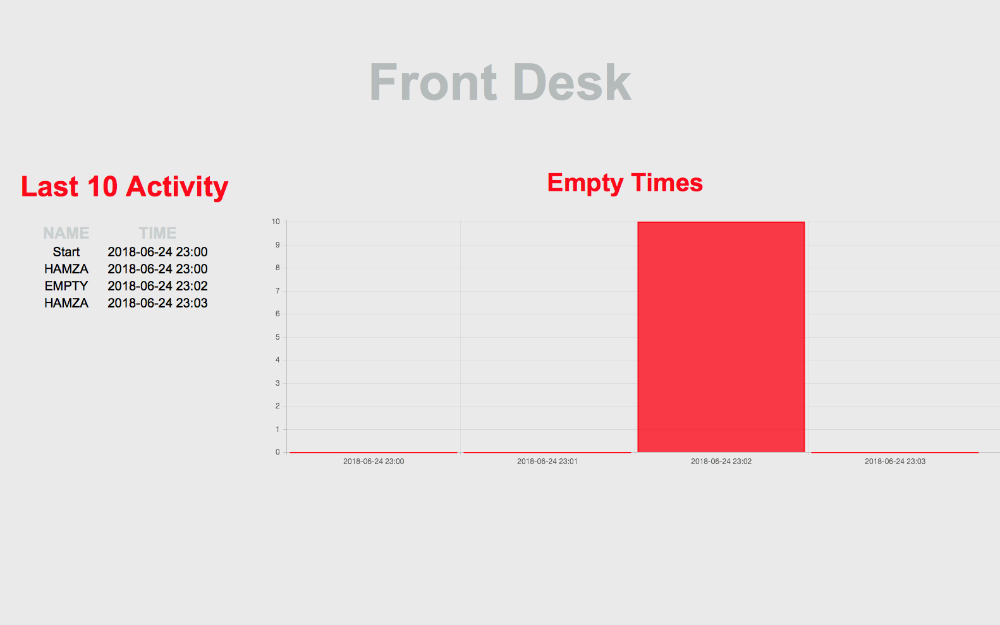

# Front Desk Check 

This is a web appliaction for manegement of front desk assistants. The system is taking pictures in period and checks with face recognation if the employees are in the place. It dispays the last activities and on which time periods front desk was empty. 



To start the server:

```
python3 main_code.py --refresh-time 15 --pit-time 1 --last-x 10
```


It also saves the all activities in csv format.  

**!!! It is currently taking pictures from the build in webcam !!!**